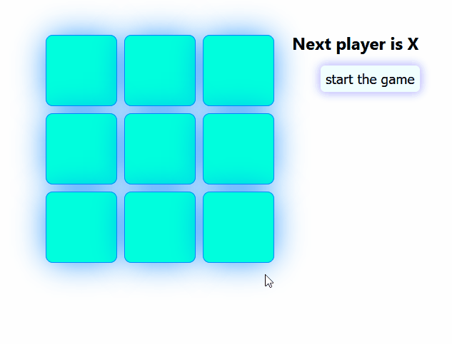

# Tic Tac Toe
A *Tic Tac Toe* game, built with `React`.

# Getting Started
1. Clone the repository
2. Install the application `npm install`
3. Run the application in development mode, or build it with react-scripts
    - `npm run start` - run the app in _development_ mode, or
    - `npm run build` - create a _production_ build
4. Browse it on your computer [http://localhost:3000/](http://localhost:3000/)

# Product

## Dependencies
See [package.json](package.json)
  - Node JS 12
  - React & React DOM 16.10
  - React Scripts 3.2.0
